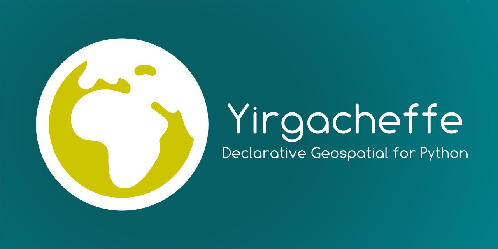

# Introduction



## Overview

Yirgacheffe is a Python library that provides a declarative way of working with geospatial data, taking care of all the tedious tasks of aligning rasters, rasterizing polygons, and dealing with memory management and other hardware management issues. You can think of it as numpy or pandas but for geospatial data. Here's a quick example of calculating a species Area Of Habitat using Yirgacheffe:

```python
import yirgaceffe as yg

with (
    yg.read_raster("habitats.tif") as habitat_map,
    yg.read_raster('elevation.tif') as elevation_map,
    yg.read_shape('species123.geojson') as range_map,
):
    refined_habitat = habitat_map.isin([...species habitat codes...])
    refined_elevation = (elevation_map >= species_min) & (elevation_map <= species_max)
    aoh = refined_habitat * refined_elevation * range_polygon * area_per_pixel_map
    print(f'Area of habitat: {aoh.sum()}')
```

## Installation

Yirgacheffe is available via pypi, so can be installed with pip for example:

```SystemShell
$ pip install yirgacheffe
```

## Basic features

### Layers

They main unit of data in Yirgacheffe is a "layer", which wraps either a raster dataset or polygon data, and then you can do work on layers without having to worry (unless you choose to) about how they align. Yirgacheffe will automatically infer if you want to do an intersection of maps or a union of the maps based on the operators you use (see below for a full table). You can explicitly override that if you want.

### Expressions on layers

Rather than working with arrays of pixel values as you would with say GDAL, Yirgacheffe lets you directly operate on layers without having to worry about reading and writing the individual values within.

### Lazy loading and evaluation

Yirgacheffe uses a technique from computer science called "lazy evaluation", which means that only when you resolve a calculation will Yirgacheffe do any work. So in the first code example given, the work is only calculated when you call the `sum()` method. All the other intermediary results such as `refined_habitat` and `refined_elevation` are not calculated either until that final `sum()` is called. You could easily call sum on those intermediaries if you wanted and get their results, and that would cause them to be evaluated then.

Similarly, when you load a layer, be it a raster layer or a vector layer from polygon data, the full data for the file isn't loaded until it's needed for a calculation, and even then only the part of the data necessary will be loaded or rasterized. Furthermore, Yirgacheffe will load the data in chunks, letting you work with rasters bigger than those that would otherwise fit within your computer's memory.

### Automatic expanding and contracting layers

When you load raster layers that aren't of equal geographic area (that is, they have a different origin, size, or both)then Yirgacheffe will do all the math internally to ensure that it aligns the pixels geospatially when doing calculations.

If size adjustments are needed, then Yirgacheffe will infer from the calculations you're doing if it needs to either crop or enlarge layers. For instance, if you're summing two rasters it'll expand them to be the union of their two areas before adding them, filling in the missing parts with zeros. If you're multiplying or doing a logical AND of pixels then it'll find the intersection between the two rasters (as areas missing in one would cause the other layer to result in zero anyway).

### Direct access to data

If doing per-layer operations isn't applicable for your application, you can read the pixel values for all layers (including VectorLayers) by calling `read_array` similarly to how you would for GDAL.

### Parallel saving

There is a parallel version of save that can use multiple CPU cores at once to speed up work, that is added as an experimental feature for testing in our wider codebase, which will run concurrently the save over many threads.

### GPU support

Yirgacheffe has multiple backends, with more planned. Currently you can set the `YIRGACHEFFE_BACKEND` environmental variable to select which one to use. The default is `NUMPY`:

* `NUMPY`: CPU based calculation using [numpy](https://numpy.org/)
* `MLX`: Apple/Intel GPU support with CPU fallback based on [MLX](https://ml-explore.github.io/mlx/build/html/index.html)

Note that GPU isn't always faster than CPU - it very much depends on the workload, so testing your particular use-case is important.

## Citation

If you use Yirgacheffe in your research, please cite our paper:

> Michael Winston Dales, Alison Eyres, Patrick Ferris, Francesca A. Ridley, Simon Tarr, and Anil Madhavapeddy. 2025. Yirgacheffe: A Declarative Approach to Geospatial Data. In *Proceedings of the 2nd ACM SIGPLAN International Workshop on Programming for the Planet* (PROPL '25). Association for Computing Machinery, New York, NY, USA, 47–54. https://doi.org/10.1145/3759536.3763806

<details>
<summary>BibTeX</summary>

```bibtex
@inproceedings{10.1145/3759536.3763806,
  author = {Dales, Michael Winston and Eyres, Alison and Ferris, Patrick and Ridley, Francesca A. and Tarr, Simon and Madhavapeddy, Anil},
  title = {Yirgacheffe: A Declarative Approach to Geospatial Data},
  year = {2025},
  isbn = {9798400721618},
  publisher = {Association for Computing Machinery},
  address = {New York, NY, USA},
  url = {https://doi.org/10.1145/3759536.3763806},
  doi = {10.1145/3759536.3763806},
  abstract = {We present Yirgacheffe, a declarative geospatial library that allows spatial algorithms to be implemented concisely, supports parallel execution, and avoids common errors by automatically handling data (large geospatial rasters) and resources (cores, memory, GPUs). Our primary user domain comprises ecologists, where a typical problem involves cleaning messy occurrence data, overlaying it over tiled rasters, combining layers, and deriving actionable insights from the results. We describe the successes of this approach towards driving key pipelines related to global biodiversity and describe the capability gaps that remain, hoping to motivate more research into geospatial domain-specific languages.},
  booktitle = {Proceedings of the 2nd ACM SIGPLAN International Workshop on Programming for the Planet},
  pages = {47–54},
  numpages = {8},
  keywords = {Biodiversity, Declarative, Geospatial, Python},
  location = {Singapore, Singapore},
  series = {PROPL '25}
}
```

</details>

## About

Yirgacheffe was created by [Michael Dales](https://digitalflapjack.com/) whilst working on multiple geospatial projects as a way to hide the boilerplate associated with working with large raster and polygon geospatial datasets.

The code for Yirgcheffe is [available on Github](https://github.com/quantifyearth/yirgacheffe/).
